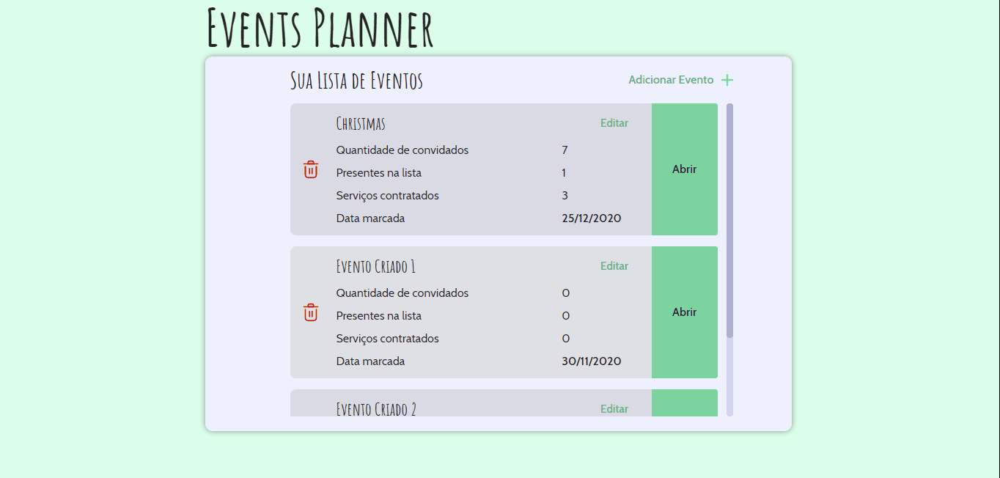
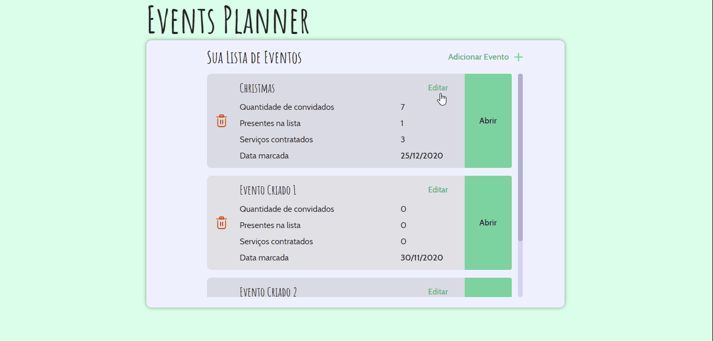

<h1 align="center">Events Planner</h1>

<p align="center">
  Esta aplicação ajuda na organização de eventos, gerenciando Lista de Convidados e de Serviços contratados e seus gastos.
  <br />
  Aplicação Web criada utilizando React Js no front-end, postgres e nodeJs na base de dados.
</p>

<p align="center">
  <a aria-label="React" href="https://github.com/facebook/react">
    </img>
  </a>
</p>

<p align="center">
  <a aria-label="Node.JS" href="https://github.com/nodejs/node">
    </img>
  </a>
</p>

Para iniciar o frontend desta aplicação, na raiz do projeto dê os segintes comandos:

```bash
cd frontend
yarn
yarn start
```

Após o carregamento, o React abrirá a aplicação em seu navegador padrão na pagina  `localhost:3000`



Demonstração do comportamento do banco de dados da aplicação:


